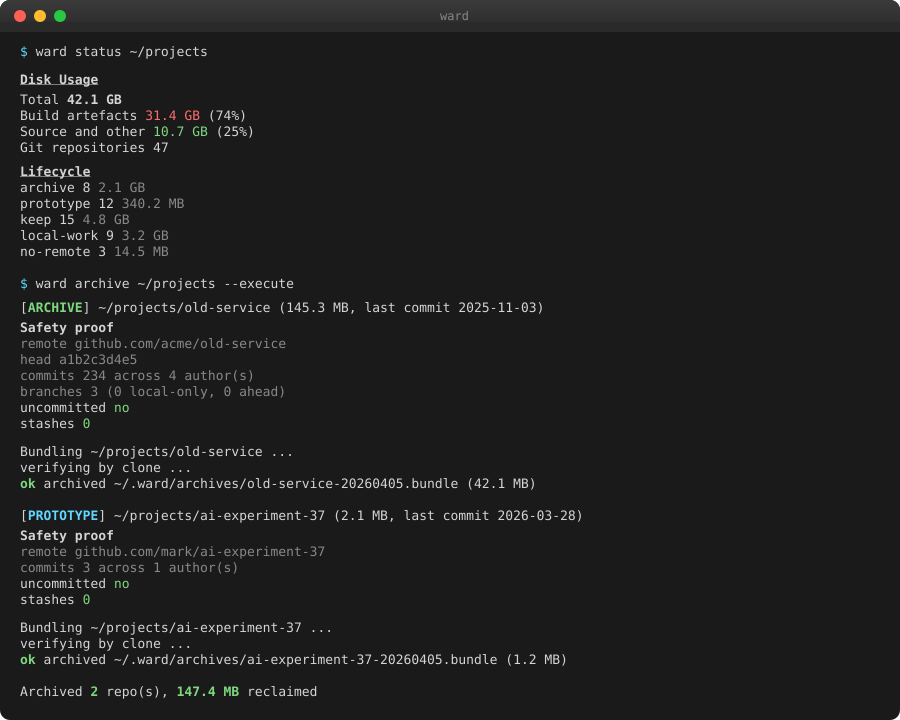

<p align="center">
  
</p>

<h3 align="center">A disk space reclaimer for developer workspaces</h3>

<p align="center">
  Find regenerable build artefacts, duplicate repo clones, and stale projects across your machine.<br>
  Dry-run by default. Archives before deleting. Aware of active work.
</p>

---

<p align="center">
  
</p>

---

## What it does

`reap` scans a directory tree (defaults to `~/projects`), identifies disk-heavy patterns that developers accumulate over time, and reclaims space safely.

It finds build artefacts (`target/`, `node_modules/`, `.next/`, `dist/`, `__pycache__`, `.gradle/`, `build/`), duplicate git clones with identical remotes, and stale repositories whose branches are all pushed and working trees clean. Every destructive command is dry-run by default, and archived repos get a compressed tarball with a JSON manifest so you can restore them later.

```
$ reap status ~/projects
Analysing /home/mark/projects ...

Disk Usage Overview
  Total:              11.0 GB
  Build artefacts:     2.0 GB (18%)
  Source and other:    9.0 GB (81%)
  Git repositories:   47

Stalest Repositories
  ~/projects/old-prototype (579.1 KB, last commit: 2025-02-11)
  ~/projects/experiment-alpha (870.6 KB, last commit: 2025-02-18)
```

```
$ reap clean ~/projects --older-than 60d
Scanning /home/mark/projects for build artefacts...
  2.0 GB ~/projects/big-rust-app/target (last modified: unknown)
  163.5 MB ~/projects/side-project/target (last modified: unknown)

Total reclaimable: 2.1 GB across 2 artefact(s)

Dry run. Use --execute to actually remove artefacts.
```

## Install

Build from source.

```
git clone git@github.com:michaelmillar/reap.git
cd reap
cargo build --release
```

The binary is at `./target/release/reap`. Symlink or copy it into your `$PATH`.

```
ln -s $(pwd)/target/release/reap ~/.local/bin/reap
```

## Quick start

```
reap status                       # overview of ~/projects
reap clean --older-than 30d       # preview removable artefacts
reap clean --execute              # actually remove them
reap dupes                        # find duplicate git clones
reap archive --execute            # archive safe-to-archive repos
reap restore                      # list archives
reap restore my-old-repo          # restore a specific one
```

All commands accept an optional path argument. With no argument, they operate on `~/projects`.

## Commands

### status

Prints a disk usage breakdown for a path, including total size, build artefact size with percentage, source size, git repo count, and the five stalest repositories by last commit date.

```
reap status [path]
```

### clean

Finds regenerable build artefacts and lists them by size (largest first). Colour-coded by size (red over 1 GB, yellow over 100 MB, green under). Build artefact directory must either match on name alone (`target`, `node_modules`, `.next`, `__pycache__`, `.gradle`) or have a recognised sibling config file (`dist` needs `package.json` or a webpack/vite config, `build` needs `build.gradle` or `CMakeLists.txt`).

```
reap clean [path] [--execute] [--older-than <duration>]
```

`--older-than 30d` or `--older-than 4w` restricts to artefacts in projects whose last commit (or mtime, if not a git repo) is older than the cutoff.

### dupes

Finds git repositories that share the same remote origin URL (normalised to strip `.git`, SSH prefix, protocol). Groups them and marks the most recent as `keep` and the rest as `remove`.

```
reap dupes [path]
```

### archive

Assesses each git repo and marks it `SAFE` or `SKIP` based on two checks, all branches pushed and no uncommitted changes. Also prints the pm project status if pm's SQLite database exists at `~/.local/share/pm/projects.db`. With `--execute`, creates a gzipped tarball and JSON manifest in `~/.reap/archives/`, then removes the original directory.

```
reap archive [path] [--execute]
```

### restore

With no argument, lists all archives with original path, archive date, and size. With an archive name, extracts it back to the original path and removes the archive.

```
reap restore [name]
```

## How it compares

Generic disk tools tell you where space has gone. `reap` knows what to do about it.

| Tool | Artefact patterns | Dry-run | Project-aware | Archives | Duplicate repos |
|------|------------------|---------|---------------|----------|----------------|
| `du` / `ncdu` | No | N/A | No | No | No |
| `dust` | No | N/A | No | No | No |
| `npkill` | `node_modules` only | Yes | No | No | No |
| `cargo-clean-all` | `target` only | No | Yes (Rust) | No | No |
| `git gc` | No | No | Yes (single repo) | No | No |
| **`reap`** | **7 ecosystems** | **Yes** | **Yes** | **Yes** | **Yes** |

**Where reap is stronger.** One tool spans Rust, Node, Python, Gradle, CMake, and Next.js. Archives before deleting so recovery is one command. Finds duplicate clones (the same icon library checked out in three projects). Reads pm's database so you do not archive what you are still working on.

**Where reap is weaker.** No interactive TUI, `ncdu` wins for exploring. No per-file size view. No incremental scanning, a full walk runs each invocation. No cloud storage backend for archives.

**The closest alternative is running `ncdu` and manually deleting.** That works until you have 40 projects and want to answer "which repos can I archive safely". `reap` answers that question directly.

## How it fits with pm

`reap` optionally reads [`pm`](https://github.com/michaelmillar/pm)'s SQLite database to surface project status in `reap archive`. The dependency is one-way, `pm` does not know `reap` exists. This keeps the tools independent, `pm` answers "what should I work on", `reap` answers "what is wasting disk space". Different domain, different usage cadence (daily vs monthly).

## Status

0 tests. Single binary. Pure Rust, no C dependencies at runtime (SQLite is bundled).

Not yet implemented.

- Interactive TUI mode
- Per-project artefact breakdown
- Cloud archive backends (S3, B2)
- Incremental rescans with cached sizes
- Config file for custom artefact rules
- MySQL/Postgres dump size detection
- Integration tests

## Licence

Private. Not currently published.
